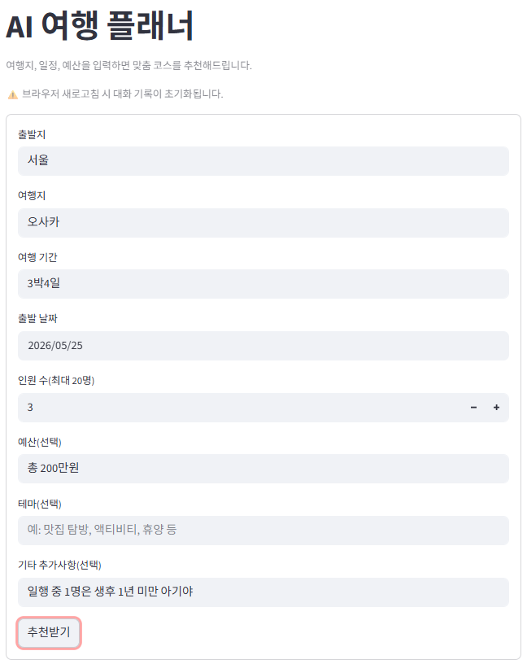
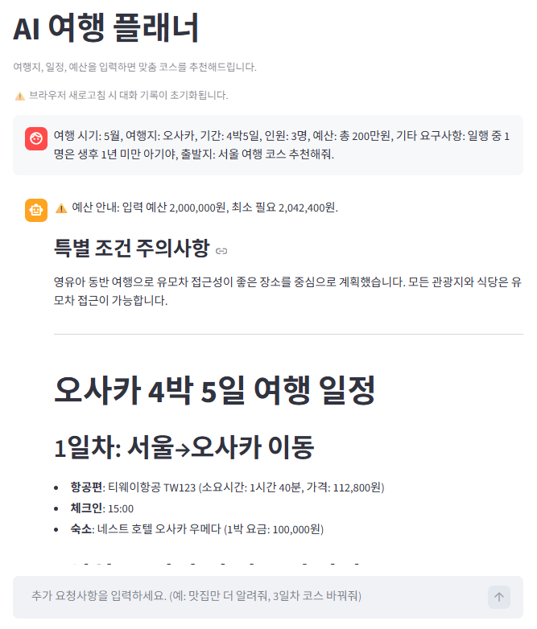

# 🧳 AI 여행 플래너 (LLM Trip Service)

LangGraph 기반 멀티턴 AI 여행 일정 추천 서비스입니다.  
사용자의 여행지, 기간, 예산, 인원, 특수 조건(영아 동반 등)을 입력하면 맞춤 여행 코스를 생성합니다.




---

## ✨ 주요 기능

- **맞춤 여행 일정 생성**: 여행지, 기간, 예산, 인원, 테마, 특수 조건 반영
- **RAG 기반 DB 조회**: ChromaDB에 저장된 기존 여행 데이터 우선 활용
- **실시간 웹 검색**: Tavily API로 최신 숙소·맛집·교통 정보 보완
- **멀티턴 대화**: 후속 질문으로 일정 수정 및 추가 요청 가능
- **예산 검증**: 입력 예산과 실제 필요 예산 비교 안내
- **특수 조건 처리**: 영아 동반, 노약자, 반려동물 등 조건 반영
- **커스텀 미들웨어**: ToolMessage 제외 요약(`FilteredSummarizationMiddleware`), 최종 답변 후 메시지 정리(`FilteredToolMessageAfterModel`)로 컨텍스트 효율 최적화
- **LangSmith 트레이싱**: Agent 실행 전 과정의 툴 호출·토큰 사용량 실시간 모니터링

---

## 🛠️ 기술 스택

| 분류 | 기술 |
|------|------|
| **LLM** | OpenAI GPT-4o-mini |
| **프레임워크** | LangChain, LangGraph |
| **벡터 DB** | ChromaDB |
| **웹 검색** | Tavily API |
| **로컬 LLM** | Ollama (qwen2.5:7b) |
| **모니터링** | LangSmith |
| **UI** | Streamlit |
| **언어** | Python 3.11 |

---

## 🏗️ 시스템 아키텍처

```
사용자 입력 (Streamlit UI)
        ↓
   LangGraph Agent ──────────────────── LangSmith (실행 전 과정 트레이싱)
        ↓
  ┌─────────────────────┐
  │  1. search_chroma   │  ← ChromaDB 벡터 검색 (기존 여행 데이터)
  │  2. search_web      │  ← Tavily 웹 검색 (최신 정보 보완)
  └─────────────────────┘
        ↓
   GPT-4o-mini (답변 생성)
        ↓
   Streamlit UI 렌더링
```

---

## ⚙️ Agent 동작 흐름

```
1. ChromaDB에서 관련 여행 데이터 조회
2. DB 결과가 충분하면 → 바로 답변 생성
3. DB 결과가 부족하면 → Tavily 웹 검색으로 보완
4. 숙소·식당·가격 정보는 항상 웹 검색 추가 수행
5. JSON 형식으로 최종 답변 생성 → Streamlit에서 마크다운 렌더링
```

---

## 📦 설치 및 실행

### 1. 저장소 클론
```bash
git clone https://github.com/JaeH-Y/LLM_TripService.git
cd LLM_TripService
```

### 2. 가상환경 생성 및 패키지 설치
```bash
python -m venv trip_venv
trip_venv\Scripts\activate  # Windows
pip install -r requirements.txt
```

### 3. 환경변수 설정
프로젝트 루트에 `.env` 파일 생성:
```
OPENAI_API_KEY=your_openai_api_key
TAVILY_API_KEY=your_tavily_api_key
LANGSMITH_API_KEY=your_langsmith_api_key
LANGSMITH_TRACING=true
LANGSMITH_PROJECT=llm-trip-service
```

### 4. 실행
```bash
streamlit run agent_main.py
```

---

## 📁 프로젝트 구조

```
LLM_TripService/
├── agent_main.py                  # Streamlit UI + Agent 실행 진입점
├── my_agent.py                    # LangGraph Agent · 커스텀 미들웨어 · 툴 정의
├── graph_state.py                 # LangGraph 상태 관리
├── vector_store.py                # ChromaDB 벡터 스토어 관리
├── main.py                        # LangGraph GraphState RAG 구현 실행 파일
├── llm_test.py                    # LLM 단위 테스트
├── llm_memory_manage_test.py      # 메모리 관리 테스트
├── requirements.txt               # 패키지 목록
└── .env                           # 환경변수 (gitignore)
```

---

## 🔍 LangSmith 모니터링

LangSmith를 통해 Agent의 실행 흐름을 실시간으로 추적합니다.

- 각 툴 호출 입력/출력 확인
- 단계별 토큰 사용량 분석
- 검색 쿼리 품질 개선에 활용

---

## 📝 개선 예정

- [ ] 실시간 항공권·숙소 API 연동 (Skyscanner, Booking.com)
- [ ] C# 데스크탑 앱과 연동

---

> **Note**: AI가 생성한 여행 정보는 실제와 다를 수 있습니다. 예약 전 반드시 공식 채널에서 확인하세요.
